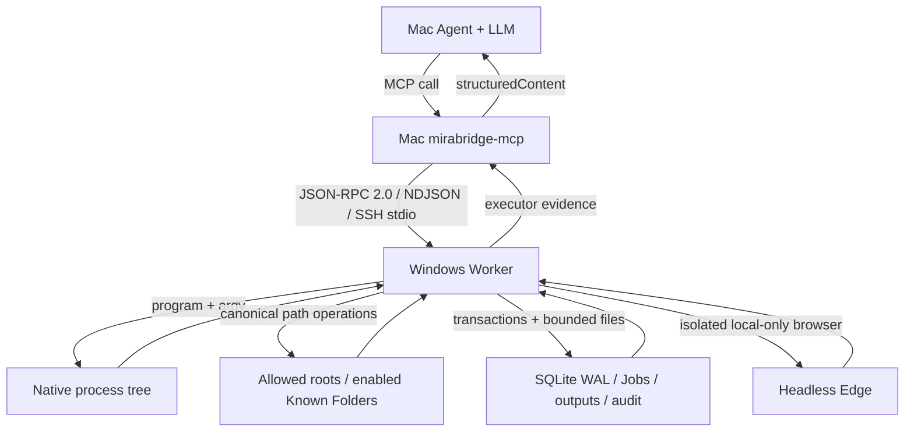

# MiraBridge 2.0.0-rc.5 architecture

## Non-negotiable invariant

```text
reasoning_host = Mac
tool_host = Windows
```

Codex on macOS owns the only Agent loop, LLM, user-goal interpretation, planning, approval interaction, and completion judgment. The Windows Worker receives one validated operation, performs it deterministically, persists executor state where required, and returns structured evidence. It contains no model SDK, API key, prompt history, dialogue memory, planner, reflection loop, or semantic completion state.

## Release and ownership boundaries

| Component | Sole responsibility | Explicit non-responsibility |
| --- | --- | --- |
| Plugin + Skill | Windows-only triggering guidance, MCP registration, tool approval policy | Replacing Mac tools, starting Windows eagerly, session migration |
| `packages/protocol` | RPC 2.0 schemas, 28 tool inputs, errors, scoped IDs, Job states, limits | SSH, filesystem/process behavior, semantic judgment |
| `packages/mcp-server` | Mac config, lazy SSH pool, host-key enforcement, MCP results, file/directory transfer orchestration | Windows path enforcement, LLM inference |
| `packages/windows-worker` | Windows path policy, files, processes, output decoding, Jobs/ConPTY, SQLite, audit, GC, Recycle Bin, Edge, transfer commit | Agent behavior or goal completion |
| `packages/cli` | Mac enrollment/config diagnostics | Duplicating Worker or MCP runtime logic |

MiraBridge is an independent `2.0.0-rc.5` release boundary. It does not register with or modify PAF/Mira's existing runtime MCP owner.

## Runtime flow



The MCP process starts without SSH. `mira_bridge_list_nodes` reads only Mac TOML. The first node-bound call lazily starts system `ssh` with `BatchMode`, `IdentitiesOnly`, strict host-key checking, and MiraBridge's managed `known_hosts`. One stdio session is reused per node. A connection loss creates one replacement session and retries once with the same request ID.

## Workspaces and path authority

`open_workspace` accepts an existing absolute drive path under either an `allowed_root` or an explicitly enabled Known Folder such as Desktop. The Worker rejects UNC, device, ADS, relative, traversal, wildcard path-management, and drive/system escape forms. Roots/workspaces are canonicalized through real paths.

Every file, cwd, transfer, screenshot, and path-management call resolves its target again. Existing targets and the nearest existing parent of a new target must remain inside both workspace and allowed capability boundary. Walks and manifests reject links. Writes, edits, moves, transfers, and screenshots revalidate immediately before atomic commit. Workspace root deletion/replacement is always refused.

These checks protect Worker-owned filesystem APIs. The product defaults to an Administrator account so native child processes can perform local-equivalent Windows work. That also means they can attempt anything the administrator account can do: `allowed_roots` and cwd validation are not a syscall sandbox. Security therefore depends on Mac-side approvals, exact operations, public-key SSH with pinned host identity, narrow configured roots for Worker APIs, UAC/Defender/firewall/EDR, and audit review.

## Process execution

`mira_bridge_exec` accepts `program` and `args`, never an unstructured shell command. `.exe` runs directly; `.cmd/.bat` use the tested Windows adapter in `cross-spawn`. The shared output layer probes stdout/stderr independently: strict UTF-8 remains UTF-8, otherwise the active Windows console code page is decoded and all stored evidence is normalized to UTF-8. `console`/`cpNNN` overrides are explicit and unsupported pages fail. There are no program-name patches and MiraBridge never translates Bash.

`mira_bridge_powershell` is separate and high-approval. It uses `-NoLogo -NoProfile -NonInteractive -EncodedCommand`, forces UTF-8, suppresses only progress chatter, and preserves real stderr. Audit records store a script hash and redacted summary rather than the full script.

Synchronous execution is capped at 30 minutes; longer operations use Jobs. Timeout/cancel terminates the recorded Windows process tree with `taskkill /T /F`.

## Durable Job model

A Job represents executor state, not a user task. Its only states are `queued`, `starting`, `running`, `exited`, `failed_to_start`, `cancelled`, `timed_out`, and `lost`.

`start_job` persists the scoped ID, spec hash, idempotency key, paths, and state before launch. A local Windows CIM `Win32_Process.Create` call creates the runner outside the OpenSSH session process tree. A random local named pipe carries the transient spec/environment so secrets do not enter runner argv, SQLite, or audit. The runner transactionally acquires a concurrency slot, starts the process, drains bounded streams, updates SQLite, triggers GC, and exits.

Windows app update/uninstall and new durable Job admission are serialized by one Worker-owned execution-maintenance row in SQLite. Lease acquisition reconciles and counts active Jobs in the same transaction that writes the bounded lease; `start_job` checks the lease in its insertion transaction. Existing idempotent retries can still recover their original Job, but a genuinely new Job returns retryable `NODE_MAINTENANCE`. Startup/repair releases only the known app-owned lease after Worker and SSH health pass; an abandoned lease expires. This closes the check-then-update race without adding another runtime or changing SQLite `user_version=5`.

`list_jobs` makes Jobs discoverable after Mac/MCP context loss and scopes results to the selected node. Keyset cursors bind the status filter and a stable snapshot, so new rows cannot shift later pages. Worker/MCP restarts do not remove running work. Startup reconciles runner/child PID plus process-start identity and heartbeat; it terminates an unowned surviving child before recording a terminal executor state. Completed metadata/logs remain until their separate retention deadlines. `wait_job` blocks at most 60 seconds per call.

Jobs default to closed stdin. `stdin_mode=pipe` persists a random local input endpoint and forwards bounded UTF-8 writes plus EOF without TTY semantics. `stdin_mode=conpty` uses the same endpoint, Job record, runner, logs, cancellation, and idempotency path with a packaged framework-dependent, architecture-neutral .NET 10 IL assembly around the OS Pseudo Console API. The native x64 or ARM64 `dotnet.exe` host loads the same assembly. The helper receives program/argv/cwd/environment over its anonymous stdin—not its command line—and emits raw UTF-8 VT. `@xterm/headless` parses that evidence into an atomically persisted active-screen snapshot with cursor/title/size/sequence. Resize and input remain local control messages; a new MCP/SSH Worker reconnects to the same detached runner. Audit stores hashes/byte counts/control metadata, never input plaintext. This is one durable Job runtime, not a second Agent/session system.

## Hardware and architecture discovery

The Worker reports native Windows architecture separately from the Node process architecture so an ARM64 host running an emulated x64 process is visible instead of misreported as an x64 machine. MiraBridge bundles the official Node 24 Windows x64 and ARM64 distributions; true 32-bit x86 Windows is outside the runtime contract because Node 24 does not publish that host binary.

GPU discovery always starts from the complete Windows `Win32_VideoController` inventory and then enriches matching NVIDIA rows with `nvidia-smi` memory/driver/CUDA evidence. It never returns early after finding one vendor. NVIDIA, AMD, Intel, Microsoft/other, virtual, mixed-adapter, and no-hardware-GPU configurations therefore keep the same process/filesystem/Job/transfer contract. Vendor-specific compute or media acceleration is task evidence, not a Worker dependency: callers probe CUDA/NVENC, AMF, QSV, DirectML, or another requested runtime explicitly and may use CPU fallback only when the acceptance target permits it.

## Output and storage lifecycle

Each stdout/stderr stream is always drained. Up to 256 MiB is retained per stream by default. If that cap is crossed, the file keeps a head, an explicit omission marker, and the last 64 KiB while counting `total_bytes` separately from `stored_bytes`. MCP inline output is 64 KiB per stream; range/log reads are at most 256 KiB.

Worker data lives under `%LOCALAPPDATA%\MiraBridge`:

- requests and normal outputs: 7 days;
- Job logs: 14 days;
- Job metadata, idempotency, request tombstones, and audit: 90 days;
- transfer temporaries: 24 hours;
- Recycle Bin receipts: 15 minutes;
- total quota: 10 GiB, reduced toward 90% when exceeded;
- minimum free space: 2 GiB.

Full GC runs at startup when due, at the configured interval, after Job completion when due, and before new disk-producing operations. A persisted lease prevents duplicate concurrent scans. Cross-process reservations atomically account for pending output/Job/transfer bytes before work starts. Active/queued Jobs, config, SQLite, current operations, and active reservations are protected. If only protected data remains over the limit, new output/Job/transfer operations fail while status, diagnostics, reads, and cancellation stay available.

## Transfer model

File transfer uses sequential 512 KiB chunks, size/SHA-256 verification, same-directory temporary files, and atomic rename.

Directory transfer creates one native tar archive plus a controlled sorted manifest containing every directory/file size/hash. A bounded summary replaces the inline manifest when the 2 MiB RPC envelope would be exceeded; up to 250,000 entries remain hash-verified. Both sides reject traversal, absolute paths, duplicate/case-colliding Windows names, links/special files, unknown tar escapes, and archive/manifest disagreement before extraction. Extraction happens in a sibling staging directory; post-extract hashes are compared before atomic exchange. SQLite assigns one live process identity as commit owner so two SSH Worker processes cannot install the same transfer concurrently. With overwrite, the old destination is temporarily renamed and restored on failure; startup recovers dead-owner phases and never rolls back a live owner. A successful install can report deferred backup cleanup without turning the operation into a false failure. There is no merge, watcher, or synchronization state.

## Desktop, Recycle Bin, and Edge

- Desktop is resolved from the Windows Known Folder API/PowerShell, not guessed. Its access is independently `disabled`, `read-only`, or `read-write`.
- Recycle Bin scanning is a fixed Worker implementation over the current SSH account's physical items. The receipt hashes drive, physical name, original path, size, and timestamps. Clear accepts only the receipt, recomputes it, clears represented drives, and rescans.
- Edge snapshots launch `playwright-core` against the installed `msedge` channel with a new isolated context. No existing profile, login, extension, click flow, `file:`, `data:`, or browser-internal URL is used. Local-only mode aborts external requests and redirects. Screenshot/optional DOM commit inside the workspace atomically.

## Why no second Agent, translator, or sync engine

A Windows Agent would duplicate context, authorization, model credentials, completion semantics, and failure ownership. Command translation is ambiguous and unsafe; capability discovery lets the Mac Agent generate native Windows operations directly. Repository synchronization would add watcher/conflict/Git state unrelated to the execution-runtime goal. Explicit transfer is sufficient and auditable.

## Compatibility

All packages and CLIs are `2.0.0-rc.5`; RPC remains `2.0` and the public surface remains 28 tools. The 2.0 major changes source, installation, pairing and update ownership without introducing a protocol-major break. SQLite migrates in one transaction to `user_version=5` while retaining earlier state; the maintenance lease reuses that schema's existing maintenance table. A different protocol major returns `PROTOCOL_MISMATCH`; unknown optional fields within major 2 are ignored. Scoped opaque IDs retain the node identity so workspaces, Jobs, outputs, transfers and scan receipts route correctly after MCP restart.
