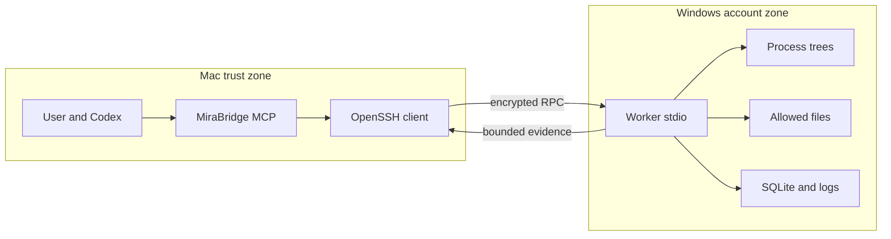

# MiraBridge 2.0.0-rc.7 threat model

## Executive summary

MiraBridge deliberately converts authority held by a Mac Agent into native Windows process and file operations. The highest-risk areas are the Mac-to-Windows authorization decision, SSH host enrollment, the Worker path/cwd boundary, and the default Administrator account's system authority. Existing schema validation, pinned SSH transport, canonical paths, bounded output, idempotency, and process-tree control reduce common abuse, but a compromised trusted Mac or an unsafe approved process can have administrator-level impact.

## Scope and assumptions

- In scope: `plugins/mira-bridge/.mcp.json`, `packages/protocol`, `packages/mcp-server`, `packages/windows-worker`, `packages/cli`, `apps/windows`, installer/update/recovery scripts, GitHub release workflows, and plugin/Skill configuration.
- Runtime model: one operator, one or more manually selected nodes, trusted LAN or existing secure SSH network, no public Worker port, a Windows Administrator account, and no multi-tenancy. The user explicitly made Administrator the default product route on 2026-08-21. UAC, Defender/EDR, public-key-only SSH, pinned host identity, LocalSubnet/trusted-VPN firewall scope, and narrow Worker roots remain required assumptions.
- Data sensitivity: source code, local project files, rendered artifacts, process output, audit data, and optionally operator-supplied process environment values.
- Out of scope: the broader Mira Runtime, Codex/LLM internals, Windows OpenSSH implementation, Windows kernel/NTFS correctness, public relay/NAT, and general remote GUI control.
- Tests and fake SSH are development surfaces, not production transports.

Open questions that materially change ranking: whether port 22 is ever internet-reachable; whether UAC/Defender/EDR or approval gates are disabled; and whether several mutually untrusted users share a node. A yes to any raises TM-001/TM-003/TM-004 and invalidates the single-operator baseline.

## System model

### Primary components

- Codex plugin/Skill routes explicit Windows tasks and declares approval defaults (`.codex-plugin/plugin.json`, `.mcp.json`, `skills/mira-bridge/SKILL.md`).
- Mac MCP server validates tool inputs, reads Mac TOML, launches native SSH lazily, and orchestrates transfer (`packages/mcp-server/src/server.ts`, `ssh-rpc.ts`, `transfers.ts`).
- Protocol package owns limits, schemas, IDs, errors, redaction, and states (`packages/protocol/src/schemas.ts`, `constants.ts`, `redaction.ts`).
- Windows Worker validates RPC, paths, process specs, archives, cleanup receipts, and browser policy; persists requests, Jobs, output, retention state, and audit (`packages/windows-worker/src/stdio-server.ts`, `path-policy.ts`, `process-exec.ts`, `transfers.ts`, `recycle-bin.ts`, `web-snapshot.ts`, `storage.ts`, `state.ts`).
- MiraBridge for Windows owns onboarding/status/configuration and delegates privileged OpenSSH/firewall/ACL work to one elevated helper. Velopack owns app installation/update; the Worker owns atomic Job/maintenance admission, while a separate durable recovery receipt and verified previous full package guard post-update health (`packages/windows-worker/src/state.ts`, `apps/windows/src/MiraBridge.Windows`, `MiraBridge.Elevated`, `UpdateRecoveryStore.cs`).

### Data flows and trust boundaries

- User/Codex → Mac MCP server: tool name and structured arguments over local MCP stdio; Zod schemas bound paths, args, environment, timeouts, and result envelope.
- Mac MCP server → native SSH: node host/user/key path and pinned `known_hosts`; OpenSSH supplies encryption, server authentication, and public-key client authentication; there is no application rate limiter.
- SSH stdio → Windows Worker: UTF-8 JSON-RPC/NDJSON up to 2 MiB; strict envelope/operation schemas, protocol-major check, request hash, and duplicate ledger.
- Worker → Windows filesystem: normalized workspace/file/transfer paths; canonical realpath and allowed-root checks; NTFS account ACL is the final boundary for child processes.
- Worker → Windows process tree: structured argv or explicit PowerShell; Administrator authority; timeouts and `taskkill /T /F` cancellation.
- Detached runner → pipe-mode child stdin: random local named pipe, bounded UTF-8 messages, explicit EOF; same-account local code can access Worker state and is already inside the Administrator trust zone.
- Worker → SQLite/log files: request responses/tombstones, workspace handles, Job metadata/logs, outputs, cleanup receipts, GC leases, and audit under `%LOCALAPPDATA%\MiraBridge`; same Windows account can modify this state.
- Worker → Edge: a new isolated headless context renders only policy-approved HTTP(S) URLs; local-only mode blocks external requests/redirects and no user browser profile is loaded.
- Worker → Mac MCP → Agent: structured results and bounded output; schema validates envelope, but the trusted node controls semantic content.
- GitHub Release → Velopack → Windows app: channel/RID feed, SHA-256-verified package and unsigned RC binaries cross the public software-supply boundary. Update is click-initiated, atomically excludes active/new Job admission with a bounded Worker maintenance lease, is preceded by Worker-state and previous-package backup, and is followed by Worker/SSH health verification or external rollback.

#### Diagram

## Assets and security objectives

| Asset | Why it matters | Security objective (C/I/A) |
| --- | --- | --- |
| Mac SSH private key and node config | Grants the Windows Administrator account access and binds node identity | C/I |
| Windows project and render files | May contain proprietary source, user data, or valuable artifacts | C/I/A |
| Windows execution authority/GPU/CPU | Can modify data, consume resources, or execute malicious payloads | I/A |
| Job and request ledger | Prevents duplicate side effects and supports recovery | I/A |
| stdout/stderr and output files | May contain diagnostics, source fragments, or secrets | C/I/A |
| Audit records | Supports accountability and incident reconstruction | I/A |
| Plugin/Worker build artifacts | Define code executed on trusted Mac and Windows hosts | I |
| Installer/update feed and rollback package | Can replace the trusted Windows app/Worker and must preserve a known-good recovery path | I/A |

## Attacker model

### Capabilities

- Can influence user prompts, project files, filenames, command arguments, PowerShell content, and tool output when the Agent processes untrusted repositories/data.
- May be a LAN adversary during initial enrollment or a malicious/compromised Windows host after trust is established.
- May run code inside an allowed workspace with Administrator authority after an approved execution.
- May create files/Junctions inside locations writable by that account and attempt races.
- May generate very large output, logs, search trees, Jobs, or transfer inputs.
- May attempt to replace, truncate or replay a downloaded installer/update or tamper with the local rollback receipt/package under the same Administrator account.

### Non-capabilities

- Cannot reach a custom Worker network listener because none exists.
- Does not possess the Mac private key and cannot reach a custom Worker listener. After a user-approved native execution, however, that process intentionally inherits Administrator authority.
- Cannot make the Worker run an LLM or autonomous task loop because no such dependency or entry point exists.
- Cannot bypass Codex approval merely by returning executor exit code 0; semantic completion remains on the Mac.

## Entry points and attack surfaces

| Surface | How reached | Trust boundary | Notes | Evidence (repo path / symbol) |
| --- | --- | --- | --- | --- |
| MCP tool calls | Codex invokes one of 28 tools | Agent → MCP | Structured schemas and approval annotations | `packages/protocol/src/schemas.ts: toolDefinitions` |
| Mac TOML | CLI/operator file | Operator config → MCP | Host, user, key path, fingerprint, command | `packages/mcp-server/src/config.ts: loadMacConfig` |
| SSH child | First node-bound tool | Mac → Windows | Strict host checking and key-only auth | `packages/mcp-server/src/ssh-rpc.ts: SshRpcClient.start` |
| NDJSON RPC | SSH Worker stdin | SSH → Worker | 2 MiB line, JSON/Zod, request ledger | `packages/windows-worker/src/stdio-server.ts: WorkerStdioServer` |
| Workspace/file paths | MCP arguments | Worker → NTFS | Drive-only, canonical root/workspace checks | `packages/windows-worker/src/path-policy.ts: PathPolicy` |
| Native argv/PowerShell | Exec and Job tools | Worker → process | Child inherits account rights; PowerShell separate | `packages/windows-worker/src/process-exec.ts` |
| Transfer chunks/archive | Private RPC operations | Mac ↔ Worker files | Offset, size, SHA, controlled manifest, tar preflight, staging/rollback | `packages/windows-worker/src/transfers.ts: TransferStore` |
| Job runner bootstrap | Random local named pipe | SSH Worker → CIM-created persistent runner | Secret env is transient, metadata persisted first; pipe name only is in argv | `packages/windows-worker/src/persistent-runner.ts`, `jobs.ts: startJob` |
| Durable Job input | Random local named pipe named in protected Worker state | New SSH Worker → detached runner → child stdin | 64 KiB writes, 1 MiB pre-attach buffer, request-id replay protection, plaintext omitted from audit, no network listener | `packages/windows-worker/src/job-input.ts`, `jobs.ts: writeJobInput` |
| SQLite/log/audit | Local Windows files | Worker → persistent state | Same-account integrity, no remote append-only sink | `packages/windows-worker/src/state.ts`, `audit.ts` |
| Recycle Bin receipt | Scan then clear tools | Agent → fixed Windows cleanup | 15-minute full snapshot, scoped ID, pre/post verification | `packages/windows-worker/src/recycle-bin.ts` |
| Edge navigation | Snapshot tool | Worker → local/external web | Isolated context, HTTP(S), local-only default, no profile/interactions | `packages/windows-worker/src/web-snapshot.ts` |
| Storage lifecycle | Startup/hourly/Job/disk operations | Worker → local data | TTL, quota, free-space reserve, lease, protected active Jobs | `packages/windows-worker/src/storage.ts` |
| Installer/update | User click and GitHub Release feed | Public supply chain → Windows app | Velopack checks package integrity; RC unsigned; Worker maintenance lease atomically excludes active/new Jobs; previous full package is copied/hashed; post-update doctor/SSH failure launches external rollback | `packages/windows-worker/src/state.ts: beginExecutionMaintenance`, `apps/windows/src/MiraBridge.Windows/WindowsOperations.cs`, `Program.cs`, `apps/windows/src/MiraBridge.Windows.Core/UpdateRecoveryStore.cs` |

## Top abuse paths

1. Prompt/repository content convinces the Mac Agent to approve a broad native command → command runs with Administrator rights → data beyond the intended project or system state is changed.
2. LAN attacker spoofs the target during first `ssh-keyscan` → operator fails to compare the independent fingerprint → attacker's host becomes pinned and receives future tool operations/files.
3. Attacker creates or swaps a Junction between path validation and replacement → write/transfer targets a different location → integrity loss within the account's writable ACL scope.
4. Approved program ignores the Worker's cwd boundary and uses absolute paths → account has excessive rights → source or user files outside configured roots are read/modified.
5. Secret is supplied in argv or printed by a process → persisted stdout/stderr or audit summary exposes it to users/processes that can read `%LOCALAPPDATA%\MiraBridge`.
6. Attacker emits many Jobs/output/request IDs → queue/stream bounds are reached and protected active data prevents GC from restoring quota → new disk-producing operations become unavailable.
7. Worker or its state is compromised → forged cached response/log says a command succeeded → Mac Agent makes a wrong semantic decision from untrusted evidence.
8. Same Windows account edits `audit.jsonl`/SQLite after misuse → local forensic trail is altered → accountability and incident response degrade.
9. Recycle Bin contents change between user review and clear → an old approval could delete unexpected items → snapshot mismatch must stop the clear.
10. A page or redirect tries to reach external/private services or reuse browser login state → information crosses the intended rendering boundary → URL/request policy and isolated profile must block it.
11. Same-account local code reads a pipe endpoint from Worker state and injects input into an active Job → process behavior changes → this does not cross the documented Administrator account trust boundary, but must remain detectable through input hashes and Windows process telemetry.
12. Release asset or local recovery state is tampered with, or a new Job races an app precheck → a malicious/broken app could replace a trusted Worker, interrupt durable work or prevent recovery → package/attestation/hash checks, transactional Worker maintenance admission, managed rollback containment and post-update health must fail closed; unsigned RC origin verification remains an operator responsibility.

## Threat model table

| Threat ID | Threat source | Prerequisites | Threat action | Impact | Impacted assets | Existing controls (evidence) | Gaps | Recommended mitigations | Detection ideas | Likelihood | Impact severity | Priority |
| --- | --- | --- | --- | --- | --- | --- | --- | --- | --- | --- | --- | --- |
| TM-001 | Prompt injection or compromised Mac | User approves Windows execution; project content can influence Agent | Induce an unsafe but valid exec/PowerShell/Job | Administrator-level data destruction, code execution, or security-control changes | Files, host integrity, execution authority | Prompt approvals in `.mcp.json`; Skill safety rules; separate PowerShell; exact structured argv | Worker is not a command allowlist/sandbox | Keep high-risk tools prompt-gated; inspect untrusted projects; retain UAC/Defender/EDR; consider AppLocker/WDAC | Alert on unusual programs, system paths, destructive args, repeated approvals | medium | critical | critical |
| TM-002 | LAN MITM during enrollment | Operator trusts `ssh-keyscan` output without independent comparison | Substitute an attacker host key | File/command disclosure and forged results | SSH trust, files, evidence | Fingerprint display/confirmation in `packages/cli/src/index.ts`; runtime verifies configured fingerprint against the managed key before strict SSH checking in `ssh-rpc.ts` | Human comparison during first enrollment can still fail | Document two-channel verification; record node asset identity; rotate through explicit re-enrollment | Alert on config/managed-key mismatch and SSH host-key mismatch; audit node enrollment separately | low | high | high |
| TM-003 | Code in writable workspace | Can create/swap Junctions and win a race | Redirect new file or atomic replacement after validation | Write/read outside intended workspace within ACL rights | Project files | Canonical `realpath`, nearest-parent checks, link-skip, pre-commit rechecks in `path-policy.ts` and `runtime.ts` | TOCTOU cannot be eliminated by path strings alone | Deny link creation via ACL where possible; use narrow ACLs; consider handle-based Windows APIs in later hardening | Log canonical target and rejection; test Junction races on Windows | medium | high | high |
| TM-004 | Approved native process | Default Administrator route | Program accesses absolute paths or Windows APIs directly | Exfiltration, system modification, persistence, or security-control changes beyond Worker file APIs | Windows files, credentials, host integrity | Explicit approvals; cwd validation; structured argv; UAC/Defender/firewall retained; audit metadata | Worker cannot mediate arbitrary program syscalls and `allowed_roots` do not contain native processes | Prefer exact programs/args; inspect source before execution; use EDR and optional AppLocker/WDAC or a disposable VM for untrusted code | Windows process/object telemetry, EDR, UAC events, registry/service/task changes | medium | critical | critical |
| TM-005 | Tool caller or executed process | Secret supplied via argv/env/output | Persist or expose sensitive value | Credential leakage | Logs, audit, project data | Env values omitted from Job DB/audit; sensitive arg forms redacted in `redaction.ts`; output bounded | Non-standard argv and process output can still leak; local logs persist | Prefer short-lived env secrets; add output retention/redaction policy; never pass secrets in argv | Secret scanning of logs with protected handling; monitor access to data root | medium | high | high |
| TM-006 | Malicious workload | Can start many unique requests/Jobs or emit logs | Exhaust disk, CPU, memory, or SQLite | Denial of service | Worker availability, Windows compute | Queue cap, concurrency lease, cross-process capacity reservations, one GC lease, 256 MiB stream cap, TTL, 10 GiB quota, 2 GiB reserve, due-time/pre-write GC in `storage.ts` | Protected active Jobs can still consume quota; no OS CPU/memory quota | Monitor status; cancel verified abusive Jobs; use Windows resource controls if required | Alert on quota rejection, reservation leakage, queue depth, GC actions, disk/free-space trend | medium | medium | medium |
| TM-007 | Compromised trusted Windows node | Host key remains trusted | Forge structured results or cached evidence | Wrong Agent decisions; artifact integrity loss | Evidence, files, Job state | SSH authenticates node; RPC schema and 2 MiB limit in `ssh-rpc.ts` | Authentication does not prove host integrity or semantic truth | Verify critical artifacts with hashes/signatures; patch/monitor node; cross-check acceptance evidence | Compare artifact hashes, detect impossible state transitions | low | high | medium |
| TM-008 | Administrator session or local malware | Can write the Worker data directory | Modify/delete audit and SQLite after activity | Lost forensics, hidden duplicate/replay history | Audit, request/Job ledger | JSONL plus SQLite WAL persisted in `%LOCALAPPDATA%` | No tamper-evident or remote audit sink | Forward audit to protected Windows Event Log/SIEM for higher-assurance deployments; monitor the data root | Alert on audit truncation, DB integrity errors, file ACL changes | medium | medium | medium |
| TM-009 | Concurrent user/process | Authorized scan exists; Bin changes before clear | Add/remove/replace physical Recycle Bin items | Unexpected permanent deletion | User deleted data | Full physical snapshot hash, 15-minute receipt, one-time consumption, pre/post scan in `recycle-bin.ts` | Windows clear cmdlet is not transactional across drives | Keep receipt window short; stop on any change; report partial per-drive failure | Audit scan/clear IDs, hashes, counts, bytes, per-drive result | low | high | medium |
| TM-010 | Malicious local page/redirect | Snapshot is approved | Navigate/fetch external or private services, exploit profile state | Network disclosure or browser attack | Network, screenshots, host | HTTP(S) only, loopback default, request/redirect blocking, isolated Edge context, no profile/extensions/clicks in `web-snapshot.ts` | Browser engine vulnerabilities; external mode deliberately broadens reach | Keep external disabled; patch Edge; use a dedicated host/account; never treat snapshot as safe browsing | Record URL/final URL/blocked requests/browser errors; alert on external-mode use | low | high | medium |
| TM-011 | Code already running as the Worker account | Can read `%LOCALAPPDATA%\MiraBridge` or enumerate local pipes | Inject bounded stdin or EOF into a pipe-mode Job | Job corruption or premature completion | Job integrity and evidence | Random endpoint, local-only pipe, bounded messages, explicit mode/EOF, MCP approval, request ledger, hashed audit in `job-input.ts` and `stdio-server.ts` | Same-account endpoint has no separate application credential; target process can echo input into logs | Protect Worker data ACLs, avoid multi-user nodes, monitor unexpected hashes/timing; use a distinct OS identity if isolation is required | Correlate MCP audit input hashes with process behavior and local pipe/process telemetry | low | medium | low |
| TM-012 | Compromised release path, same-account malware, or concurrent client | User initiates update, attacker can alter local update state, or another caller can start Jobs | Supply a bad package, tamper with recovery state, race a Job into maintenance, or prevent post-update recovery | Trusted-code replacement, interrupted durable work, or Worker outage | Installer, Worker, Jobs, execution authority, durable availability | GitHub TLS/release attestation/SBOM, Velopack package checksum, RID-specific feeds, transactional Worker maintenance lease plus `NODE_MAINTENANCE`, Worker-state backup, managed rollback-root containment, previous-package size/SHA-256, post-update Worker doctor plus SSH check, external `Update.exe` rollback | RC executable is unsigned; same Administrator can alter app/data and recovery evidence; synchronous operations are not frozen by the Job lease; first public RC has no prior public WPF feed for a full downgrade drill | Verify Release SHA-256 and attestation; sign stable builds; protect GitHub account/workflow; keep package mutation inside the lease window; complete real old-RC downgrade and code-signing gates before stable | Alert on maintenance owner/expiry, denied Job admission, update-recovery state/error, package hash failure, unexpected version, repeated rollback, GitHub workflow/attestation failure | low | critical | high |

## Criticality calibration

- Critical: pre-auth/public remote execution, SSH authentication bypass, private-key theft, or unsafe approved administrator execution. No custom/public Worker listener is present, but TM-001/TM-004 retain critical impact because Administrator is the intentional product route.
- High: likely loss of protected project data or arbitrary execution within a materially privileged Windows account. Examples: broad ACL process escape; successful Junction write outside intended roots; accepted spoofed host.
- Medium: targeted availability loss, local log-secret exposure, forged evidence from an already compromised node, or audit tampering. Examples: filling the Worker data directory; same-account audit deletion.
- Low: noisy invalid RPC or low-sensitivity metadata leakage with easy recovery. Examples: rejected malformed JSON; a failed out-of-bounds probe recorded locally.

Risk is most sensitive to internet exposure, approval quality, untrusted code execution, disabled Windows defenses, and multi-user sharing. Administrator authority is already assumed and reflected in the critical TM-001/TM-004 rankings.

## Focus paths for security review

| Path | Why it matters | Related Threat IDs |
| --- | --- | --- |
| `packages/mcp-server/src/ssh-rpc.ts` | Constructs trust-critical OpenSSH invocation, retry, and protocol parsing | TM-002, TM-007 |
| `packages/mcp-server/src/transfers.ts` | Handles Mac paths, temporary files, hashes, and overwrite races | TM-005, TM-006 |
| `packages/protocol/src/schemas.ts` | Defines every untrusted input size and operation contract | TM-001, TM-006 |
| `packages/protocol/src/redaction.ts` | Prevents common secret forms from entering audit | TM-005 |
| `packages/windows-worker/src/stdio-server.ts` | RPC validation, protocol negotiation, duplicate ledger, and audit dispatch | TM-006, TM-007, TM-008 |
| `packages/windows-worker/src/path-policy.ts` | Canonicalization and allowed-root/Junction boundary | TM-003, TM-004 |
| `packages/windows-worker/src/process-exec.ts` | Native argv and process-tree timeout/cancel behavior | TM-001, TM-004 |
| `packages/windows-worker/src/jobs.ts` | Detached runner bootstrap, idempotency, leases, and recovery | TM-005, TM-006 |
| `packages/windows-worker/src/job-input.ts` | Bounded local Job stdin and EOF lifecycle | TM-006, TM-011 |
| `packages/windows-worker/src/transfers.ts` | Windows destination/source validation and atomic transfer commit | TM-003, TM-006 |
| `packages/windows-worker/src/state.ts` | Persistent replay, Job/output/transfer integrity, and atomic execution-maintenance admission | TM-006, TM-008, TM-012 |
| `packages/windows-worker/src/storage.ts` | Retention, quota pressure, active-Job protection, and GC lease | TM-006, TM-008 |
| `packages/windows-worker/src/recycle-bin.ts` | Permanent cleanup receipt and postcondition | TM-001, TM-009 |
| `packages/windows-worker/src/web-snapshot.ts` | Edge profile and navigation/network boundary | TM-001, TM-010 |
| `apps/windows/src/MiraBridge.Windows/WindowsOperations.cs` | Update decision, Worker maintenance lease, backup, download/apply and diagnostics preview | TM-005, TM-012 |
| `apps/windows/src/MiraBridge.Windows.Core/UpdateRecoveryStore.cs` | Previous-package containment/hash, persistent recovery state and rollback state machine | TM-008, TM-012 |
| `.github/workflows/release.yml` | Cross-architecture package, SBOM, attestation, collision-safe asset publication | TM-012 |
| `.mcp.json` | Plugin-level approval and timeout boundary | TM-001 |
| `skills/mira-bridge/references/safety-rules.md` | Agent workflow for destructive operations and cleanup | TM-001 |
